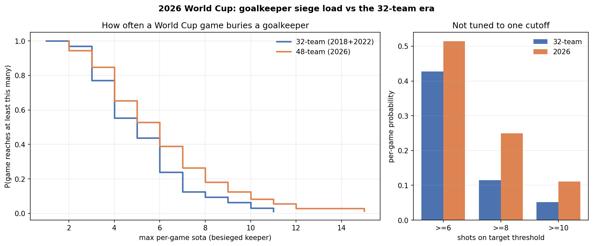

# wc2026-keeper-siege

**Did the 48-team 2026 World Cup really bury goalkeepers more often than the old 32-team tournaments? Answered with real match data, not a toy model.**

The 2026 World Cup became "the goalkeepers' World Cup": Cape Verde's 40-year-old
Vozinha denying Spain, Curaçao's Eloy Room making 15 saves in one game, minnows
hanging on for dear life. The natural question: is that just vibes, or did
expanding the field from 32 to 48 teams **structurally** produce more one-sided,
keeper-burying games?

This repo answers it honestly:

- **Real data.** Per-game goalkeeper logs for 2018, 2022 and 2026, pulled from FBref.
- **Full distribution, no cherry-picked threshold.** We plot the whole shape of
  per-game "siege load" and show the 6/8/10-save cutoffs only as a sensitivity check.
- **Two signals, not one.** Saves *and* shots-on-target-against — because a 74%-possession
  battering can produce few saves (hello, Spain 0–0 Cape Verde) and still be a siege.
- **A statistical test**, not an eyeballed gap.

> Why so careful? An earlier version of this analysis used a Monte-Carlo *simulation*
> and got (rightly) taken apart on r/dataisbeautiful for modelling data that already
> existed. This rewrite does it the way the critics asked. The best objections from
> that thread are baked into the method here.

---

## Results

Group stage only: **2018 + 2022 (32-team, 96 games)** vs **2026 (48-team, 72 games)**.
For each game we take the more-besieged keeper (the higher of the two keepers' values).

| Per-game "siege load" | 32-team era | 2026 | Shifted higher? |
|---|---|---|---|
| **Saves** (median / mean) | 3 / 3.62 | 3 / 3.89 | **No** — Mann-Whitney p = 0.42, KS p = 0.92 |
| **Shots on target faced** (median / mean) | 5 / 5.18 | 6 / 5.97 | **Yes** — Mann-Whitney p = 0.035 |



**The honest takeaway — which contradicts the viral "sieges tripled" framing:**

- Count **saves**, and 2026 is *statistically indistinguishable* from past World Cups
  (identical median, p = 0.42). The dramatic "goalkeepers are being buried" claim is
  not supported by save counts.
- Count **shots on target faced** — the actual pressure a keeper is under — and 2026
  *is* significantly more lopsided (p = 0.035, ~2.2× as likely to reach 8+). Expansion
  really did add mismatches.
- Reconciling the two: 2026 keepers **face more, but don't save more**, because more of
  those extra shots go *in* against weaker sides rather than being stopped. "Goalkeeper
  sieges" is real as *pressure*, an artifact as *saves*.

**Caveat, stated up front:** small samples (72 vs 96 games), so the significant result
is real but *modest*, not a landslide. The saves result is a genuine null. Comparing real
tournaments also confounds expansion with era/tactics — Part 2 (`model.py`) is what will
isolate the pure expansion effect. Sanity check: the pipeline recovers Vozinha's 7 saves
vs Spain and Al-Owais' 9 vs Uruguay from the raw data.

---

## The flow (five small steps)

Each step is one small, commented module in `wc_siege/`. Read them in order.

| Step | File | What it does |
|------|------|--------------|
| 1 | `collect.py` | Pull goalkeeper match logs from FBref (2018/2022/2026) → `data/raw/` |
| 2 | `clean.py` | Reshape into one tidy row per team-per-game → `data/processed/team_games.csv` |
| 3 | `analyze.py` | Per-game siege distributions, expansion decomposition, significance test |
| 4 | `model.py` | *(Part 2)* fit + **validate** an expansion model against the real data |
| 5 | `viz.py` | The charts for Reddit / LinkedIn → `figures/` |

`run.py` chains them together.

---

## Run it

### See the whole pipeline right now (no internet, fake data)

```bash
pip install -r requirements.txt
python run.py --demo
```

This generates clearly-labelled **synthetic** data and runs steps 2–5 so you can
watch the flow. Every synthetic output is stamped `SAMPLE` / `NOT REAL`.

### Run it for real

FBref blocks cloud/datacenter IPs, so **run the collector on your own machine:**

```bash
python -m wc_siege.collect        # writes data/raw/2018.csv, 2022.csv, 2026.csv
python run.py                     # clean → analyze → viz on the REAL data
```

The raw pulls are committed to `data/raw/`, so once they exist, anyone can rerun
the analysis without touching FBref again. That is what makes this reproducible.

---

## What the numbers mean

- **Per-game siege probability** — the fraction of group-stage games where the
  besieged keeper hit a threshold. This strips out "2026 just has more games."
- **Expansion decomposition** — splits the rise in siege *count* into the part
  explained by more matches vs. the part explained by games being more lopsided.
  (This is the exact claim the original post asserted; here it's measured.)
- **Distribution test** — Mann-Whitney (is 2026 shifted higher?) and KS (do the
  distributions differ in shape?), because save counts are skewed integer data.

---

## Honesty notes

- **Group stage only.** Knockouts pit more evenly-matched sides and confound the
  comparison. (2026's Round of 32 *did* keep minnows alive longer — that's a
  separate, interesting effect, noted but not mixed in.)
- **2018 + 2022 as the 32-team baseline.** Comparing real tournaments means
  tactics/era are a confounder; we state that plainly rather than pretend a
  simulation removes it. Step 4's model is what isolates the pure expansion effect.
- **Saves ≠ siege, exactly.** That's why SoTA and PSxG ride along.

Data: FBref (StatsBomb). Tools: Python, pandas, NumPy, SciPy, Matplotlib.

## License

MIT
